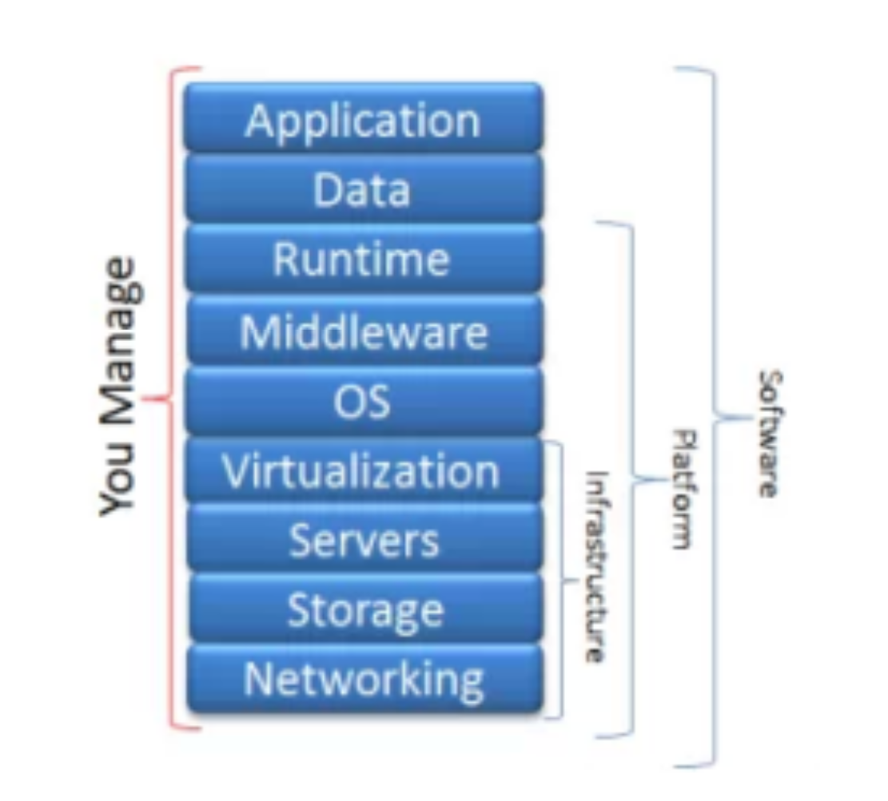
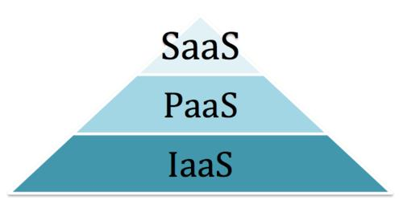
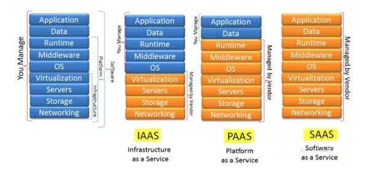
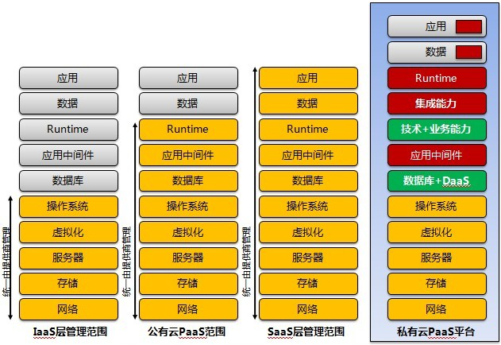
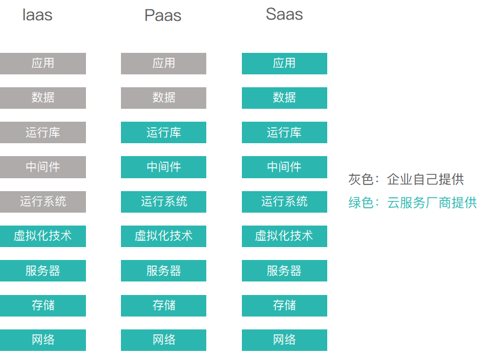

PaaS、IaaS 、SaaS
===
随着信息技术的不断发展，各种新技术不断涌现，而这其中IT基础服务形式也在不断进化。从早些年需要自建或租赁机房及物理服务器，到后来的云主机，再到如今的SaaS都是IT基础服务形式的升级，当然它们各有优劣，所以并不意味着“低层次”服务的彻底淘汰。云计算租赁服务包含常见四种类型IaaS、SaaS、PaaS、DaaS，我们一起看下不同平台能提供什么样的服务。

# 一、IaaS
IaaS是基础设施即服务。英文全称是Infrastructure as a server。它的含义是把客户需要的基础设施环境搭建好，然后开放虚拟机或者硬件的租赁服务。
用户可以利用CPU、内存、显存、网络等资源。相对于其他三种服务比较自由度比较高。用户，除了不能改变基础设施之外，可以在基础设施上自行安装任意的操作系统、任意的软件。而且，用户还可以获得部分防火墙、路由器的权限。不过有一点需要注意，那就是，安装比较繁琐，一切需要自行控制时间。使用IaaS会有一个专门的网站，客户通过账号就可以管理自己的设备。
- 优点：相对其他几种服务，它的自由度、灵活度非常的高。客户可以自行安装自己喜欢的操作系统、方便自己的数据集、需要的软件等。所以，一切东西可以自行部署。我的理解是有点像学生时代去机房上网。
- 缺点：它的维护成本比较高。使用它会导致Cpu、内存等等计算资源浪费。相关的人力资源和时间资源也会被浪费。相当于把资源分割成一个一个个性化的虚拟的电脑，它们之间互相独立。“土地”就只有这么多，分完了就没有了。而对于用户来说，必须要自行下载操作系统等等繁琐的操作。对于云端和用户来说，各种资源其实都浪费了。

# 二、PaaS
PaaS是平台即服务，英文全称是Platform as a Server。意思就是云端把客户所需的软件的平台作出租。
相当于就是云端已经给大家搭建好了平台。一般来说，在用户使用的时候，云端已经搭建好了操作系统、数据库、中间件，运行库等等。用户只需要在这个搭建好的平台上下载、安装并使用自己需要的软件就可以了。
- 优点：减少的搭建各种平台的损耗，为云端和用户节省了资源。
- 缺点：相对IaaS来说，PaaS的自由度和灵活度比较低，不太适合专业性比较高的IT技术从业人员。相当于范围被限定，在特定的范围做一些事情。我的理解有点像QQ远程控制自己的电脑处理事情。

# 三、SaaS
SaaS是软件即服务。英文全称是Software as a Server。到了这个层次，云端已经把操作系统、中间件、数据库、运行库、软件应用都部署好了。连软件都不用安装了，用户登录之后直接可以上手操作。我的理解有点像去电玩儿城玩儿街机。
- 优点：方便快捷，资源利用可以非常优化。用户使用直接管理这些软件产生的数据就可以了。而使用的时候是模块化的，选择需要功能使用就行。多用户可以并行运行。
- 缺点：软件多而且杂乱、安装复杂、使用复杂、运维复杂。用户如果不是批量采购的话购买价格昂贵。

# 四、DaaS
DaaS是数据即服务，英文全称是Date as a Server。云端部署好各种环境，收集大量数据并开始从中分析。最后把筛选、分析出来的数据作为服务。直白地说，就是大数据的一个类。涉及的服务有：客户关系管理（CRM）、企业资源规划（ERP）等等。
- 优点：从大量数据中提炼出精华，方便用户使用。
- 缺点：可能会涉及用户的隐私。数据安全问题方面可能也需要注意。
 
首先官方而言：
===
# 1.基础设施即服务 (IaaS ： Infrastructure as a Service)

把计算基础(服务器、网络技术、存储和数据中心空间)作为一项服务提供给客户。它也包括提供操作系统和虚拟化技术、来管理资源。消费者通过Internet可以从完善的计算机基础设施获得服务。

# 2.平台即服务(PaaS：Platform as a Service）

PaaS实际上是指将软件研发的平台作为一种服务，供应商提供超过基础设施的服务，一个作为软件开发和运行环境的整套解决方案，即以SaaS的模式提交给用户。因此，PaaS也是SaaS模式的一种应用。但是，PaaS的出现可以加快SaaS的发展，尤其是加快SaaS应用的开发速度。

# 3.软件即服务 (SaaS：Software as a Service)

是一种交付模式，其中应用作为一项服务托管，通过Internet提供给用户;帮助客户更好地管理它们的IT项目和服务、确保它们IT应用的质量和性能，监控它们的在线业务。
 
假设您是一家很牛的技术公司，根本不需要别人提供服务，你拥有基础设施、应用等等一切



你把它们分为三层：基础设施(infrastructure)、平台(platform)和软件(software)，如下图：  
这其实就是云计算的三个分层：  
基础设施在最下端：Infrastructure-as-a-Service(IaaS)  
平台在中间：Platform-as-a-Service(PaaS)  
软件在顶端：Software-as-a-Service(SaaS)  


如果公司什么都有，现在所处的状态叫本地部署(On-Premises)，就像在自己家做pizza一样。  
几年前如果你想在办公室或者公司的网站上运行一些企业应用，你需要去买服务器，或者别的高昂的硬件来控制本地应用，让你的业务运行起来，这就叫本地部署。  
假如BOSS突然有一天想明白了，只是为了吃上pizza，为什么非要自己做呢?  
于是，准备考虑一家云服务供应商，这个云服务供应商能提供哪些服务呢?  
其所能提供的云服务也就是云计算的三个分层：IaaS、PaaS和SaaS  
用一张图来表示就是这样的：  


大大小小企业，财力不同、问题不同，因此对于软件的开发，总有形形色色的需求。

经过演变，云服务逐渐分为三类：
```
第一种，云服务提供基础设施，我们可能听过某某说“租了哪里的服务器，准备自己搞个软件……”，其实就是Iaas。
第二种，云服务提供一个平台，企业自己设计应用，数据也由自己保管。这就是Paas。
第三种，云服务提供现成的软件，数据也全部上云。这就是SaaS。
```
如图：



从Iaas到SaaS的过程，企业需要付出的成本越来越小，云化的程度也越来越高，内部IT所需要做的事越来越少。
 
就如同我们去吃火锅，原来需要准备场地和各种材料挺麻烦，后来有人开了家火锅店，提供给桌椅、锅等少量资源，其他的还需要客人自己准备（laaS）。但这种火锅还是麻烦，客户也未必懂得怎么做火锅，不算太优。为了招揽客人，火锅店有升级了服务，这次除了桌椅铁锅还准备了需要的各种食材和锅底（PaaS）,剩下的配酱汁烹饪材料就交给客人自己了。这次客户方便了不少。随着市场竞争越来越激烈，老板又需提升服务来保持业务增涨，老板想客人来不就是要吃火锅吗，人客人自己动手配置佐料煮食材都是没有必要的，客户哪有我们专业。于是由专业的配菜和烹饪大师为客户准备好了一切，客人来了吃就行了（SaaS）。
 
 
 
# 一、SaaS：软件即服务
 
软件即服务，也称为云应用程序服务，是云市场中企业最常用的选项。SaaS利用互联网向用户交付由第三方供应商管理的应用程序。大多数SaaS应用程序直接通过你的Web浏览器运行，这意味着它们不需要在客户端进行任何下载或安装。

SaaS的局限性和担忧
- 互操作性。如果SaaS应用程序不旨在遵循开放式集成标准，则与现有应用程序和服务的集成可能成为主要问题。在这种情况下，组织可能需要设计自己的集成系统或减少对SaaS服务的依赖性，而这并非总是可能的。
- 供应商锁定。供应商可能使加入服务变得容易，而退出服务却变得困难。例如，数据可能无法在技术上或成本效益上跨其他供应商的SaaS应用程序移植，而不会产生大量成本或内部工程返工。并非每个供应商都遵循标准的API，协议和工具，但是某些业务任务可能需要这些功能。
- 缺乏集成支持。许多组织需要与本地应用程序，数据和服务进行深度集成。SaaS供应商可能在这方面提供有限的支持，从而迫使组织在设计和管理集成方面投入内部资源。集成的复杂性可能进一步限制SaaS应用程序或其他相关服务的使用方式。
- 数据安全。为了执行必要的软件功能，可能必须将大量数据交换到SaaS应用程序的后端数据中心。将敏感的业务信息转移到基于公共云的SaaS服务可能会导致安全性和合规性受损，此外还需要迁移大量数据工作负载。
- 定制化。SaaS应用程序提供最少的自定义功能。由于不存在一种千篇一律的解决方案，因此用户可能仅限于供应商提供的特定功能，性能和集成。相反，一些软件开发工具包（SDK）附带的本地解决方案提供了高度的定制选项。
- 缺乏控制。SaaS解决方案涉及将控制权移交给第三方服务提供商。这些控件不仅限于软件——在版本、更新或外观方面，而且还包括数据和管理。因此，客户可能需要重新定义其数据安全性和治理模型，以适应SaaS服务的特性和功能。
- 功能限制。由于SaaS应用程序通常以标准化形式出现，因此功能的选择可能会折衷于与安全性，成本，性能或其他组织策略的权衡。此外，供应商的锁定，成本或安全性问题可能意味着将来无法切换供应商或服务来满足新功能要求。
- 性能和停机时间。由于供应商控制和管理SaaS服务，因此你的客户现在依赖供应商来维护服务的安全性和性能。尽管有适当的服务级别协议（SLA）保护，但计划内和计划外的维护，网络攻击或网络问题仍可能影响SaaS应用程序的性能。

# 二、PaaS：平台即服务
 
云平台服务（也称为平台即服务（PaaS））为某些软件提供云组件，同时主要用于应用程序。PaaS为开发人员提供了一个框架，开发人员可以在此框架上建立并使用该框架来创建自定义应用程序。所有服务器，存储和网络都可以由企业或第三方提供商管理，而开发人员可以维护应用程序的管理。

PaaS的局限性和担忧
- 数据安全。企业可以使用PaaS解决方案来运行自己的应用程序和服务，但是驻留在第三方，由供应商控制的第三方云服务器中的数据会带来安全风险和担忧。你的安全选项可能会受到限制，因为客户可能无法使用特定的托管策略来部署服务。
- 整合。连接存储在现场数据中心或非内部云中的数据的复杂性增加，这可能影响PaaS产品可以采用哪些应用程序和服务。尤其是当不是为云构建旧版IT系统的每个组件时，与现有服务和基础架构的集成都可能是一个挑战。
- 供应商锁定。决定特定PaaS解决方案决策的业务和技术要求将来可能不再适用。如果供应商未设置方便的迁移策略，则在不影响业务的情况下可能无法切换到其他PaaS选项。
- 遗留系统的定制。PaaS可能不是现有遗留应用程序和服务的即插即用解决方案。取而代之的是，可能有必要对旧系统使用PaaS服务进行一些自定义和配置更改。最终的定制可能导致复杂的IT系统，从而可能完全限制PaaS投资的价值。
- 运行时问题。除了与特定应用程序和服务相关的限制外，PaaS解决方案可能未针对你选择的语言和框架进行优化。特定的框架版本可能不可用，或者无法与PaaS服务一起最佳使用。客户可能无法使用该平台开发自定义依赖项。
- 操作限制。具有管理自动化工作流程的自定义云操作可能不适用于PaaS解决方案，因为该平台往往会限制最终用户的操作能力。尽管这旨在减轻最终用户的操作负担，但是操作控制的丢失可能会影响PaaS解决方案的管理，配置和操作方式。

# 三、IaaS：基础架构即服务
 
云基础架构服务（称为基础架构即服务（IaaS））由高度可扩展的自动化计算资源组成。IaaS是完全自助服务，用于访问和监视计算机，网络，存储和其他服务。IaaS允许企业按需和按需购买资源，而不必直接购买硬件。
 
IaaS的局限性和担忧
 
与SaaS和PaaS模型相关的许多限制（例如数据安全性，成本超支，供应商锁定和自定义问题）也适用于IaaS模型。IaaS的特殊限制包括：
- 安全。当客户控制应用程序，数据，中间件和OS平台时，仍然可以从主机或其他虚拟机（VM）发出安全威胁。内部威胁或系统漏洞可能会将主机基础结构和VM之间的数据通信暴露给未经授权的实体。
- 在云中运行的旧系统。尽管客户可以在云中运行旧版应用程序，但基础架构可能无法设计为提供用于保护旧版应用程序安全的特定控件。在将旧版应用迁移到云之前，可能需要对旧版应用进行较小的增强，这可能会导致新的安全问题，除非对IaaS系统中的安全性和性能进行了充分的测试。
- 内部资源和培训。劳动力可能需要额外的资源和培训，以学习如何有效地管理基础架构。客户将负责数据安全性，备份和业务连续性。但是，由于对基础架构的控制不足，如果没有足够的内部培训和可用资源，则可能难以监视和管理资源。
- 多租户安全性。由于硬件资源是在可用时在用户之间动态分配的，因此要求供应商确保其他客户不能访问以前的客户存储在存储资产中的数据。同样，客户必须依靠供应商来确保VM在多租户云体系结构中得到充分隔离。

# 四、SaaS vs PaaS vs IaaS
 
每个云模型都提供特定的功能，对于你的组织而言，了解差异至关重要。无论你是需要基于云的软件作为存储选项，还是需要一个平滑的平台，还是无需物理维护即可完全控制整个基础架构，都可以使用云服务。
 
无论选择哪种选择，迁移到云都是业务和技术的未来。
 
XaaS：一切即服务
 
XaaS是在互联网世界上经常看到的一个术语，它是Everything as a Service的缩写。XaaS是指完全由客户控制的高度个性化，响应迅速，数据驱动的产品和产品，以及它们通过日常物联网驱动的源（例如手机和恒温器）提供的数据。
 
通过使用通过云生成的数据，企业可以更快地进行创新，加深客户关系，并在最初购买产品后维持销售。XaaS是自治数字企业的关键推动者。
