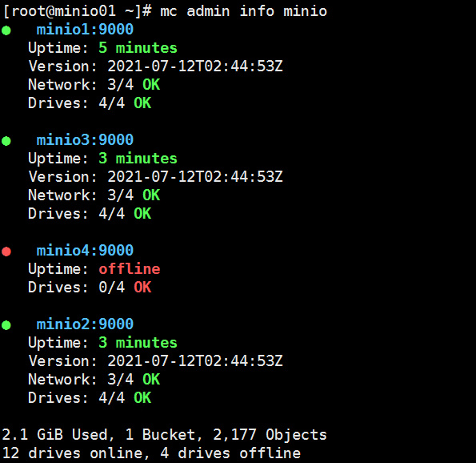

# 一、软件版本

- minio版本：minio.RELEASE.2021-07-12T02-44-53Z
- mc版本：mc:RELEASE.2021-07-27T06-46-19Z
- nginx版本：v1.20.1
- keepalived版本：v2.2.2（如果已经有SLB则无需部署）

# 二、部署解决方案

## 2.1 服务器规划

minio集群服务器规划为一共10台服务器分别为8台minio，2台nginx代理，服务器配置如下：

| 服务器角色 | 数量 | CPU/内存 | 数据磁盘 |
|-----------|------|----------|---------|
| minio服务器 | 8 | 8C16G | 4块1.5T磁盘 |
| nginx代理服务器 | 2 | 4C8G | 无 |
| minio扩容资源(后期扩容) | 8 | 8C16G | 4块1.5T磁盘 |
| minio备份资源 | 不限 | 不限 | 需要满足存放minio集群所有对象数据的空间容量 |

注意事项
- 1、minio服务节点如果使用虚拟机，需要调度虚拟机到不同的物理宿主机，避免资源竞争。
- 2、minio服务器4块数据磁盘需申请独立的磁盘，在物理底层要相互独立避免遇到磁盘io竞争，导致minio性能直线下降（性能下降严重，数据量大时会导致集群不可用）
- 3、minio数据磁盘最大不超过2T,如果使用lvm逻辑卷，逻辑卷大小也不要超过2T，过大的磁盘或文件系统会导致后期io延迟较高导致minio性能降低
- 4、minio集群一共8节点每个节点4块数据磁盘，磁盘只要存活16/2，minio集群数据就是安全的，在节点数剩余8/2+1时节点可以正常读写
- 5、如果使用lvm方式扩展集群容量，请在部署阶段minio数据目录就使用lvm。
- 6、如果需要备份minio集群数据，请准备存放minio集群所有对象数据的空间容量(1.5T*4*8=48T/2=24T)集群一共容量的一半存储空间服务器，配置内存CPU配置不需要太高。
- 7、如果网络环境允许请把minio集群节点配置双网卡，节点通信网络与客户端访问网络分开避免网络瓶颈
- 8、nginx服务器使用2台服务器实现代理服务器的高可用，nginx+keepalived来实现，如果有SLB可以直接使用自己的SLB服务，无需keepalived服务。
- 9、minio服务器系统中不要安装updatedb程序，如安装请排除扫描minio数据目录,会导致磁盘io延迟过高，会导致cpu负载过高，从而降低minio性能

```
#修改方法
[zhangzhuo@minio1 ~]$ cat /etc/updatedb.conf 
#在这里添加排除的目录
PRUNEPATHS = "/afs /media /mnt /net /sfs /tmp /udev /var/cache/ccache /var/lib/yum/yumdb /var/spool/cups /var/spool/squid /var/tmp /data1"
```

## 2.2 部署步骤

### 2.2.1 服务器优化脚本
```
#!/bin/bash

cat > sysctl.conf <<EOF
# maximum number of open files/file descriptors
fs.file-max = 4194303

# use as little swap space as possible
vm.swappiness = 1

# prioritize application RAM against disk/swap cache
vm.vfs_cache_pressure = 50

# minimum free memory
vm.min_free_kbytes = 1000000

# follow mellanox best practices https://community.mellanox.com/s/article/linux-sysctl-tuning
# the following changes are recommended for improving IPv4 traffic performance by Mellanox

# disable the TCP timestamps option for better CPU utilization
net.ipv4.tcp_timestamps = 0

# enable the TCP selective acks option for better throughput
net.ipv4.tcp_sack = 1

# increase the maximum length of processor input queues
net.core.netdev_max_backlog = 250000

# increase the TCP maximum and default buffer sizes using setsockopt()
net.core.rmem_max = 4194304
net.core.wmem_max = 4194304
net.core.rmem_default = 4194304
net.core.wmem_default = 4194304
net.core.optmem_max = 4194304

# increase memory thresholds to prevent packet dropping:
net.ipv4.tcp_rmem = "4096 87380 4194304"
net.ipv4.tcp_wmem = "4096 65536 4194304"

# enable low latency mode for TCP:
net.ipv4.tcp_low_latency = 1

# the following variable is used to tell the kernel how much of the socket buffer
# space should be used for TCP window size, and how much to save for an application
# buffer. A value of 1 means the socket buffer will be divided evenly between.
# TCP windows size and application.
net.ipv4.tcp_adv_win_scale = 1

# maximum number of incoming connections
net.core.somaxconn = 65535

# maximum number of packets queued
net.core.netdev_max_backlog = 10000

# queue length of completely established sockets waiting for accept
net.ipv4.tcp_max_syn_backlog = 4096

# time to wait (seconds) for FIN packet
net.ipv4.tcp_fin_timeout = 15

# disable icmp send redirects
net.ipv4.conf.all.send_redirects = 0

# disable icmp accept redirect
net.ipv4.conf.all.accept_redirects = 0

# drop packets with LSR or SSR
net.ipv4.conf.all.accept_source_route = 0

# MTU discovery, only enable when ICMP blackhole detected
net.ipv4.tcp_mtu_probing = 1

EOF

echo "Enabling system level tuning params"
sysctl --quiet --load sysctl.conf && rm -f sysctl.conf

# `Transparent Hugepage Support`*: This is a Linux kernel feature intended to improve
# performance by making more efficient use of processor’s memory-mapping hardware.
# But this may cause https://blogs.oracle.com/linux/performance-issues-with-transparent-huge-pages-thp
# for non-optimized applications. As most Linux distributions set it to `enabled=always` by default,
# we recommend changing this to `enabled=madvise`. This will allow applications optimized
# for transparent hugepages to obtain the performance benefits, while preventing the
# associated problems otherwise. Also, set `transparent_hugepage=madvise` on your kernel
# command line (e.g. in /etc/default/grub) to persistently set this value.

echo "Enabling THP madvise"
echo madvise | sudo tee /sys/kernel/mm/transparent_hugepage/enabled
```

### 2.2.2 minio服务器部署

#### minio数据磁盘
- 1.把数据磁盘格式化为ext4或xfs
- 2.创建minio数据目录，挂载数据磁盘到数据目录
- 3.并写入到/etc/fstab文件实现永久挂载

#### minio配置文件
```
cat /etc/default/minio.conf 
MINIO_ROOT_USER=minio
MINIO_ROOT_PASSWORD=minio123
MINIO_PROMETHEUS_AUTH_TYPE="public"
MINIO_VOLUMES="http://minio{1...8}:9000/data/minio{1...4}" 
MINIO_OPTS='--console-address \":9001\"'
```

注意事项

- MINIO_ROOT_USER管理员用户名，MINIO_ROOT_PASSWORD管理员密码
- 如果minio服务器IP地址连续可以直接写IP地址写法，不连续在本地hosts配置主机解析使用上面的方法例如：
`MINIO_VOLUMES="http://10.100.16.{1...8}:9000/data1/minio"`
- 推荐使用hosts地址映射，后期维护集群也比较简单
- MINIO_PROMETHEUS_AUTH_TYPE表示监控不需要授权验证
- MINIO_OPTS控制台端口

#### minio启动service文件
```
[root@minio1 default]# cat /etc/systemd/system/minio.service 
[Unit]
Description=MinIO
Documentation=https://docs.min.io
Wants=network-noline.target
After=network-noline.target

[Service]
WorkingDirectory=/usr/local/minio

User=root
Group=root
EnvironmentFile=-/etc/default/minio.conf
ExecStartPre=/bin/bash -c "if [ -z \"${MINIO_VOLUMES}\" ]";then echo \"Variable MINIO_VOLUEMS not set in /etc/default/minio\";exit 1;fi"
ExecStart=/usr/bin/minio server $MINIO_OPTS $MINIO_VOLUMES
Restart=always

[Install]
WantedBy=multi-user.target
```

### 2.2.3 部署nginx代理服务器

nginx配置文件示例，不加密
```
user  nginx;
worker_processes  auto;

error_log  /var/log/nginx/error.log warn;
pid        /var/run/nginx.pid;

events {
    worker_connections  4096;
}

http {
    include       /etc/nginx/mime.types;
    default_type  application/octet-stream;

    log_format  main  '$remote_addr - $remote_user [$time_local] "$request" '
                      '$status $body_bytes_sent "$http_referer" '
                      '"$http_user_agent" "$http_x_forwarded_for"';

    access_log  /var/log/nginx/access.log  main;
    sendfile        on;
    keepalive_timeout  65;

    # include /etc/nginx/conf.d/*.conf;

    upstream minio {
        server 10.202.40.183:9000;
        server 10.202.40.83:9000;
        server 10.202.41.126:9000;
        server 10.202.41.174:9000;
    }

    upstream console {
        ip_hash;
        server 10.202.40.183:9001;
        server 10.202.40.83:9001;
        server 10.202.41.126:9001;
        server 10.202.41.174:9001;
    }

    server {
        listen       9000;
        listen  [::]:9000;
        server_name  localhost;

        # To allow special characters in headers
        ignore_invalid_headers off;
        # Allow any size file to be uploaded.
        # Set to a value such as 1000m; to restrict file size to a specific value
        client_max_body_size 0;
        # To disable buffering
        proxy_buffering off;

        location / {
            proxy_set_header Host $http_host;
            proxy_set_header X-Real-IP $remote_addr;
            proxy_set_header X-Forwarded-For $proxy_add_x_forwarded_for;
            proxy_set_header X-Forwarded-Proto $scheme;

            proxy_connect_timeout 300;
            # Default is HTTP/1, keepalive is only enabled in HTTP/1.1
            proxy_http_version 1.1;
            proxy_set_header Connection "";
            chunked_transfer_encoding off;

            proxy_pass http://minio;
        }
    }

    server {
        listen       9001;
        listen  [::]:9001;
        server_name  localhost;

        # To allow special characters in headers
        ignore_invalid_headers off;
        # Allow any size file to be uploaded.
        # Set to a value such as 1000m; to restrict file size to a specific value
        client_max_body_size 0;
        # To disable buffering
        proxy_buffering off;

        location / {
            proxy_set_header Host $http_host;
            proxy_set_header X-Real-IP $remote_addr;
            proxy_set_header X-Forwarded-For $proxy_add_x_forwarded_for;
            proxy_set_header X-Forwarded-Proto $scheme;
            proxy_set_header X-NginX-Proxy true;

            # This is necessary to pass the correct IP to be hashed
            real_ip_header X-Real-IP;

            proxy_connect_timeout 300;
            # Default is HTTP/1, keepalive is only enabled in HTTP/1.1
            proxy_http_version 1.1;
            proxy_set_header Connection "";
            chunked_transfer_encoding off;

            proxy_pass http://console;
        }
    }
}
```

keepalived服务配置文件
- 如果环境已经有SLB服务，可以使用自己的SLB服务无需使用keepalived服务
- 配置keepalived服务时请确定一个VIP地址
- keepalived需要在2台nginx都安装并确定一个MASTER角色
- nginx健康监测这里使用监测脚本监控，需安装psmisc软件包，请把脚本放置在固定目录并填写脚本的绝对路径设置执行权限

监测脚本
```
[14:14:51 root@centos7 ~]#cat check_nginx_minio.sh 
#!/bin/bash
/usr/bin/killall -0 nginx && [ 200 == `curl -I http://127.0.0.1:9000/minio/health/cluster | head -n1 | awk '{print $2}'` ] && exit
systemctl restart nginx && [ 200 == `curl -I http://127.0.0.1:9000/minio/health/cluster | head -n1 | awk '{print $2}'` ] && exit
```

keepalived具体配置
```
vrrp_script check_nginx {
    script "/root/check_nginx_minio.sh" 
    interval 5
    weight -30
    fall 3
    rise 2   
    timeout 2 
}
vrrp_instance minio_lb {
    state MASTER   
    interface eth0  
    virtual_router_id 80 
    priority 100    
    advert_int 1   
    authentication { 
        auth_type PASS
        auth_pass 1111  
    }
    unicast_src_ip 192.168.10.71
    unicast_peer{
        192.168.10.72
    }
    virtual_ipaddress { 
        192.168.10.100/24 dev eth0 label eth0:1
    }
    track_script {
        check_nginx
    }
}
```

## 2.3 mc工具配置
`mc`将所有的配置信息都存储在`~/.mc/config.json`文件中
```
mc config host add <ALIAS> <YOUR-S3-ENDPOINT> <YOUR-ACCESS-KEY> <YOUR-SECRET-KEY> [--api API-SIGNATURE]

#示例
mc config host add minio http://192.168.10.100:9000 minio minio123 --api s3v4
```

# 三、备份方案

由于预计数据量过大，这里使用rclone工具进行数据同步，把minio集群bucket的对象数据同步到备份服务器，备份服务器配置可以低一些，但是存储空间需要满足minio集群存储空间的一半(如果minio集群存储空间一共48T那备份服务器需要24T的空间来备份数据)
- rclone版本为1.56.0
- 第一次进行全量同步，之后进行增量同步
- 是否使用md5校验来确定是否同步数据，根据自身需求选择，md5校验会cpu消耗较高，但是确定对象文件是否改变要比其他方式更准确
- 建议在业务负载较低时执行备份
- 数据量大时不建议进行备份，本身minio集群已经实现高可用

具体备份方法
```
#配置rclone工具
[root@minio01 ~]# cat ~/.config/rclone/rclone.conf
[minio]
type = s3
evn_auth = false
access_key_id = minio
secret_access_key = minio123
region = us-east-1
endpoint = http://192.168.10.100:9000

#验证是否可以正常使用
[root@minio01 ~]# rclone lsd minio:
          -1 2021-09-13 02:56:25        -1 s3testqwer1

#备份命令
[root@minio01 ~]# rclone sync minio:/s3testqwer1 minio/  #全量备份
[root@minio01 ~]# rclone sync minio:/s3testqwer1 minio/ --checksum  #使用md5判断文件是否需要重新同步，即增量备份
```

其他备份参数，根据自己需求可以添加
- --buffer-size=SIZE 加速 sync命令，使用内存缓存大小
- --bwlimit UP:DOWN 上传下载限速b|k|M|G,在业务需要时可根据需求设置
- --checksum 通过md5判断文件是否有需要同步，消耗cpu比较高
- --update --use-server-modtime 通过mtime判断文件是否需要同步
- --transfers=N - 并行文件数，默认为4，根据内存，以及带宽调整

推荐同步备份数据命令
```
rclone sync minio:/bucket名称 /data/minio  --transfers=8 --update -v --log-file=rclone.log
```

推荐恢复备份数据命令
```
rclone sync /data/minio minio:/bucket名称  --transfers=8 --update -v --log-file=rclone.log
```

# 四、扩容方案

## 4.1 通过一个相同规格的集群扩容(对等扩容)
扩容推荐在集群容量使用到70%时进行扩容。

扩容需要准备一个跟原有minio服务器相同规格的集群，进行服务器初始化以及安装minio，但是配置文件需要进行修改，所有minio服务器全部修改，重启所有服务，之后在nginx代理中添加新服务器。

修改后配置文件示例：
```
cat /etc/default/minio.conf 
MINIO_ROOT_USER=minio
MINIO_ROOT_PASSWORD=minio123
MINIO_PROMETHEUS_AUTH_TYPE="public"
MINIO_VOLUMES="http://minio{1...8}:9000/data/minio{1...4} http://minio{9...16}:9000/data/minio{1...4}" 
MINIO_OPTS='--console-address \":9001\"'
```

注意:
- 集群扩容时，需准备一个跟之前相同的集群或之前集群倍数的资源。比如之前为8节点16数据盘可以扩展16节点32数据盘
- 扩容节点的数据盘大小配置要跟原有集群一致

## 4.2 通过lvm逻辑卷扩容
- 使用lvm逻辑卷进行扩容minio集群，可以实现在节点增加硬盘来进行扩容minio集群
- 如果通过lvm逻辑卷扩容，部署集群时minio数据目录需要使用lvm逻辑卷
- lvm逻辑卷单个的大小不要超过2T，文件系统过大会导致minio集群io降低

例如：集群部署时使用4块1T的磁盘使用逻辑卷的方式部署四个数据目录，之后扩容时在安装4块1T磁盘把四个数据目录扩容到2T，相应的minio集群容量也扩充1倍

#### 逻辑卷创建，扩容示例

逻辑卷创建
```
#创建PV
#pvcreate /dev/sdb
Physical volume "/dev/sdb" successfully created.
#创建卷组
#vgcreate minio /dev/sdb
  Volume group "minio" successfully created
#创建逻辑卷
lvcreate -l 100%FREE -n minio minio
Logical volume "minio" created.

#格式化挂载
mkfs.xfs /dev/minio/minio
mount /dev/minio/minio /mnt/
```

扩容逻辑卷
```
#添加磁盘到pv
#pvcreate /dev/sdc
Physical volume "/dev/sdc" successfully created.       
#把pv添加到卷组
#vgextend minio /dev/sdc
Volume group "minio" successfully extended
#扩容逻辑卷
lvresize -r -l +100%FREE /dev/minio/minio
```

# 五、minio节点故障恢复数据

minio集群有纠删码机制，即使在集群数据盘挂掉一半的情况下，你集群中数据也是安全的。但是如果集群想要正常读写你需要有N/2+1的节点数才可以正常读写如果现有minio集群由于节点损坏或节点物理故障需更换节点时，请直接进行更换节点。

## 注意事项
- 如果更换节点旧节点数据量较大，在节点更换时可以正常使用请先备份原有节点数据到新节点，避免同步的数据过多导致网络带宽被占用
- 如果数据量小，可以不进行备份数据，直接进行更换，节点启动完毕会自动同步数据
- 如果节点挂掉时集群还在读写数据，会导致集群挂掉的节点与其他minio节点数据不同，这里在恢复节点后需修复数据（自动修复，无需人为干预）
- 最好部署minio集群时使用hosts文件做地址解析，避免更换节点时修改minio配置文件参数

## 5.1 更换旧的minio节点

更换的新节点没有数据
```
df -h
Filesystem             Size    Used   Avail Use%  Mounted on
devtmpfs               7.9G       0    7.9G   0%  /dev
tmpfs                  7.9G       0    7.9G   0%  /dev/shm
tmpfs                  7.9G     89M    7.8G   2%  /run
tmpfs                  7.9G       0    7.9G   0%  /sys/fs/cgroup
/dev/mapper/centos-root 17G    1.5G     16G   9%  /
/dev/sda1             1014M    137M    878M  14%  /boot
tmpfs                  1.6G       0    1.6G   0%  /run/user/0
/dev/sdd               100G     33M    100G   1% /data/minio3
/dev/sde               100G     33M    100G   1% /data/minio4
/dev/sdb               100G     33M    100G   1% /data/minio1
/dev/sdc               100G     33M    100G   1% /data/minio2
```

更换步骤
```
#验证当前节点状态，已经挂掉一个节点
[root@minio01 ~]# mc admin info minio
●  minio2:9000
   Uptime: offline
   Drives: 0/2 OK 

●  minio1:9000
   Uptime: 16 minutes 
   Version: 2021-07-12T02:44:53Z
   Network: 1/2 OK 
   Drives: 2/2 OK 

9.5 GiB Used, 1 Bucket, 10,000 Objects
2 drives online, 2 drives offline

#修改hosts文件
[root@minio01 ~]# vim /etc/hosts
192.168.10.51 minio1
192.168.10.52 minio2

#在新节点与旧节点重启服务
[root@minio01 ~]# systemctl restart minio
[root@minio02 ~]# systemctl status minio

#验证集群状态
[root@minio01 ~]# mc admin info minio
●  minio2:9000
   Uptime: 1 minute 
   Version: 2021-07-12T02:44:53Z
   Network: 2/2 OK 
   Drives: 2/2 OK 

●  minio1:9000
   Uptime: 2 minutes 
   Version: 2021-07-12T02:44:53Z
   Network: 2/2 OK 
   Drives: 2/2 OK 

9.5 GiB Used, 1 Bucket, 10,000 Objects
4 drives online, 0 drives offline
```

注意事项
- 更换节点时需要停止minio集群客户端的读写
- 更换的新节点所有配置信息要和旧节点保持一致，包括minio版本，配置文件，hosts解析文件，数据目录位置以及大小

验证更换的新节点是否有数据

```
df -h
Filesystem             Size    Used   Avail Use%  Mounted on
devtmpfs               7.9G       0    7.9G   0%  /dev
tmpfs                  7.9G       0    7.9G   0%  /dev/shm
tmpfs                  7.9G     89M    7.8G   2%  /run
tmpfs                  7.9G       0    7.9G   0%  /sys/fs/cgroup
/dev/mapper/centos-root 17G    1.5G     16G   9%  /
/dev/sda1             1014M    137M    878M  14%  /boot
tmpfs                  1.6G       0    1.6G   0%  /run/user/0
/dev/sdd               100G     33M    100G   1% /data/minio3
/dev/sde               100G     33M    100G   1% /data/minio4
/dev/sdb               100G    4.9G     96G   5% /data/minio1
/dev/sdc               100G    4.9G     96G   5% /data/minio2
```
更换的节点在启动后，会自动进行同步数据

## 5.2 集群在读写时节点损坏修复数据

**在写入数据时挂掉一个节点**



**数据写完后正常节点的数据**


**数据写完后错误节点的数据**


**启动挂掉的节点，验证集群状态**


这里可以看到集群状态已经恢复正常

**故障节点启动后，会自动修复数据，数据修复后数据目录**


注意事项

- 节点数据量大时数据恢复的时间可能较长，推荐如果数据相差较大，可以在nginx代理服务器取消节点的数据代理转发，不让节点进行写操作，只进行同步操作，之后同步完成在打开代理
- 数据恢复过程无需手动维护

# 六、minio监控

minio监控推荐使用Prometheus+grafana进行监控

## 6.1 Prometheus配置文件
```
[zhangzhuo@gs-server-10562 ~]$ cat /usr/local/prometheus/prometheus.yml 
scrape_configs:
  #这里为minio集群监控指标收集
  - job_name: minio-job
    metrics_path: /minio/v2/metrics/cluster
    scheme: http
    static_configs:
    - targets: ['10.201.60.115:9000']
  #这里为minio节点node_exporter主机监控指标
  - job_name: node
    static_configs:
    - targets: ['10.201.60.115:9100','10.201.82.139:9100','10.201.83.162:9100','10.201.83.159:9100','10.201.50.61:9100','10.201.60.142:9100','10.201.60.183:9100','10.201.60.175:9100',]
```

**minio集群grafana模板**: https://grafana.com/grafana/dashboards/13502

**minio节点主机grafana模板**: https://grafana.com/grafana/dashboards/13978?pg=dashboards&plcmt=featured-sub1

# 七、集群dome测试数据

测试说明

- 1.minio节点配置为8C16G
- 2.集群为8台minio服务器节点，集群总数据量达到16T
- 3.测试软件为cosbench，共36个测试进程分布在四台压测客户端，读写时长为30分钟经过多次测试
- 4.读写测试一同进行，读写比例为各占50%

**测试结果数据**

读写测试结果


集群监控


集群节点负载数据

| 节点名称 | CPU15分负载值 | 内存使用 | 磁盘读写速率 | 磁盘延迟 |
|---------|---------------|---------|-------------|---------|
| minio1 | 5.3 | 14.33G | 16M/s | 450ms |
| minio2 | 13.68 | 13.66G | 15M/s | 963ms |
| minio3 | 13.35 | 15.24G | 15M/s | 955ms |
| minio4 | 14.12 | 14.26G | 16M/s | 988ms |
| minio5 | 14.71 | 14G | 14.28M/s | 999ms |
| minio6 | 4.76 | 13.54G | 15.35M/s | 887ms |
| minio7 | 17.29 | 14.1G | 13.34M/s | 994ms |
| minio8 | 17.59 | 15.69G | 13.84M/s | 997ms |

测试结果
- 在读写过程，读写速率平均在50-60M/s左右，总计集群读写性能在100M/s左右
- 在高负载情况下，minio服务节点内存使用率比较高，即使增加内存也并没有多少性能提升
- 在测试中有2个minio节点cpu负载比较低，其余的cpu负载高的原因为磁盘 io延迟过高，提升方法使用单独的物理磁盘做minio节点数据盘
- 在集群数据量多的情况下minio集群的web控制端基本无法使用，但是不影响集群正常读写数据- 
